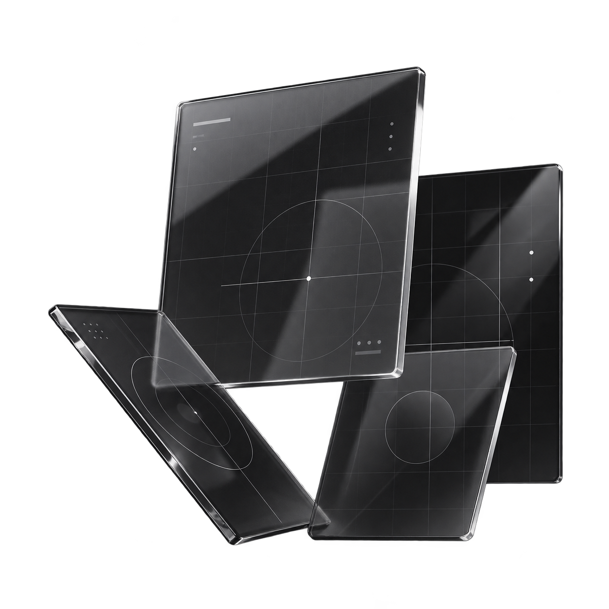

  

  
  
  
  
  
  

 

<table>
  <tr>
    <td width="68%" valign="middle">
      <h3>Sobre mim</h3>
      

        Sou desenvolvedora Front-end e UI/UX Designer, com foco na criação de 
        experiências digitais que conectam estética, funcionalidade e propósito.
      

      

        Gosto de transformar ideias em interfaces claras, intuitivas e visualmente 
        marcantes, pensando em cada projeto desde a experiência do usuário até a 
        implementação no código.
      

      

        Atualmente, desenvolvo projetos com React e JavaScript, exploro soluções 
        de design no Figma e continuo aprofundando meus conhecimentos em 
        desenvolvimento web e experiência do usuário.
      

    </td>
    <td width="32%" align="center" valign="middle">
      
    </td>
  </tr>
</table>

 

  
  

  

